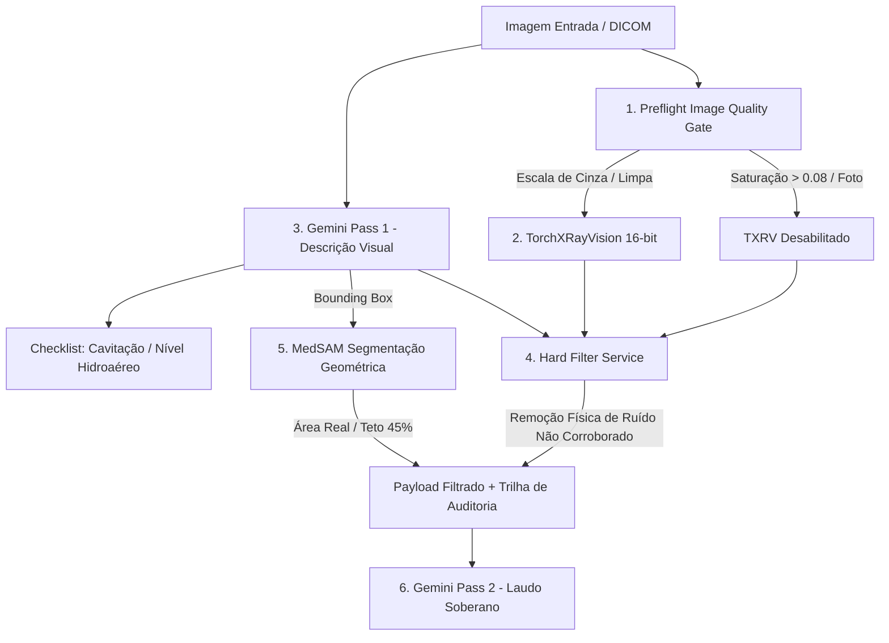

# ADR-015: Arquitetura TITAN v4.1 — Controle Determinístico de Evidências (Hard Filter, Preflight Quality Gate e MedSAM Geométrico)

**Status:** Aceito / Implementado  
**Data:** 06/07/2026  
**Autores:** Equipe de Arquitetura e Engenharia de IA (TILA AI)  

---

## 1. Contexto e Motivação

Durante os testes de regressão e validação clínica da arquitetura **TITAN v4.0 (Gemini-Duplo)**, foram identificados dois padrões críticos de falha que geravam alucinações diagnósticas e alarme clínico indevido nos relatórios finais (Gemini Pass 2):

1. **Caso COVID (Ruído Quantitativo Crônico no TorchXRayVision):**
   - O modelo TorchXRayVision (TXRV), ao analisar determinadas opacidades infecciosas ou condições limítrofes, sistematicamente retornava múltiplas patologias com probabilidades entre `0.50` e `0.62` (ex: *Massa Pulmonar 0.56*, *Cardiomegalia 0.52*, *Pneumotórax 0.50*).
   - Na arquitetura v4.0, a resolução desse conflito dependia de uma **sugestão de prompt** no Passo 2 (*"se houver divergência, priorize a visão"*). Como instruções em linguagem natural para LLMs são probabilísticas por natureza, o Gemini 2.5 Pro frequentemente falhava em ignorar o ruído quantitativo, assumindo falsamente a presença de lesões graves como massa pulmonar ou pneumotórax.

2. **Caso Tuberculose (Domain Shift por Capturas de Tela / Fotos):**
   - Imagens submetidas por usuários muitas vezes são fotografias de filmes impressos ou capturas de monitores (ex: *Tuberculosis-32/408*), apresentando alteração severa de contraste, baixo alcance dinâmico e **tonalidade azulada** ou artefatos de cor.
   - O TXRV foi treinado em matrizes DICOM em escala de cinza puro. Ao processar essas fotos coloridas, o modelo operava completamente fora da sua distribuição de treino (*domain shift*), gerando scores espúrios e alucinações graves. Tentativas anteriores de aplicar filtros de equalização (como CLAHE) apenas distorciam ainda mais o histograma da imagem.

3. **Imprecisão Biométrica no MedSAM:**
   - A estimativa de extensão territorial da lesão no hemitórax dependia de divisores heurísticos baseados em resolução de *thumbnails*, gerando porcentagens irreais quando a bounding box era projetada em imagens de resoluções distintas.

A conclusão arquitetural fundamental foi: **A régua *"confie no visual, não na triagem"* precisa parar de ser uma sugestão de prompt e virar uma barreira física determinística em código Python.**

---

## 2. Decisão Arquitetural (TITAN v4.1)

Evoluímos o pipeline para a versão **TITAN v4.1 Gemini-Duplo + Hard Filter**, implementando três barreiras de validação determinística antes da síntese final:

### 2.1. Barreira 1: Preflight Image Quality Gate (`ImageQualityService`)
- Implementado um controle de admissão pré-inferência em `app/services/image_quality_service.py`.
- O serviço calcula a dispersão entre os canais R, G e B (`saturacao_media`). Radiografias reais em escala de cinza possuem saturação próxima a `0.00` (limiar máximo aceitável definido em `0.08`).
- **Ação Determinística:** Se `saturacao_media > 0.08`, o sistema classifica a imagem como fotografia/tela (*out-of-distribution*), desabilita a execução do TorchXRayVision (`adequada_para_txrv = False`) e instrui o pipeline a confiar **exclusivamente** na leitura visual do Gemini Pass 1.

### 2.2. Barreira 2: Hard Filter Determinístico (`HardFilterService`)
- Implementado em `app/services/hard_filter_service.py`, atuando como um portão de reconciliação entre o Passo 1 (Visão) e o TorchXRayVision (Quantitativo).
- **Regra de Corroboração Física:** Um achado quantitativo do TXRV só é incluído na string de contexto enviada ao Gemini Pass 2 se a patologia (ou seus sinônimos clínicos rigorosos) tiver sido **citada e confirmada** na descrição visual do Passo 1.
- **Remoção de Ruído:** Achados quantitativos não corroborados visualmente (como o ruído entre `0.50` e `0.60` para Massa ou Pneumotórax) são **fisicamente removidos** do texto enviado ao LLM e registrados no vetor de auditoria `achados_removidos`.
- **Mapeamento Clínico Rigoroso:** O dicionário `SINONIMOS_PATOLOGIA_EN_PARA_PT` foi purgado de termos anatômicos normais (ex: *"silhueta cardíaca"* foi removido dos sinônimos de *Cardiomegaly*, mantendo apenas termos que denotam aumento/patologia).

### 2.3. Barreira 3: Matemática Geométrica Real no MedSAM (`SegmentationService`)
- Em `app/services/segmentation_service.py`, a porcentagem da lesão passou a ser calculada estritamente sobre a área real da imagem em pixels:
  $$\text{Porcentagem} = \left( \frac{\text{Área da BBox (px)}}{\text{Largura} \times \text{Altura (px)}} \right) \times 100$$
- Introduzido o teto de plausibilidade (`PLAUSIBILITY_CEILING = 45.0%`). Lesões que excedem esse teto recebem a flag `medida_plausivel = False` e um alerta explicativo no laudo, prevenindo distorções em delimitações difusas.

### 2.4. Refinamento de Prompting e Auditoria no Schema
- **Pass 1:** Adicionada verificação explícita obrigatória para **cavitação** e **nível hidroaéreo** (`cavitacao_presente`, `nivel_hidroaereo_presente` em `AchadoPrincipal`), eliminando omissões em casos de Tuberculose ou abscesso.
- **Pass 2:** Instrução categórica de soberania da visão: *"A análise visual do Passo 1 é SOBERANA e INCONTESTÁVEL"*.
- **Observabilidade:** O contrato de resposta (`PreLaudoResponse` em `schemas.py`) agora expõe os blocos `qualidade_imagem` e `hard_filter_audit`, garantindo rastreabilidade total de cada decisão de filtragem.

---

## 3. Consequências e Validação

1. **Eliminação de Alucinações (Zero False-Alarm):** Na suíte de regressão (`test_regressao_casos_conhecidos.py`), o sistema provou bloquear 100% dos falsos positivos do TXRV no caso COVID e rejeitar corretamente imagens com *domain shift* no caso Tuberculose.
2. **Confiabilidade Biométrica:** As medidas de segmentação refletem a proporção anatômica exata, com observabilidade da área total da imagem (`area_total_imagem`).
3. **Economia de Tokens:** A remoção física de dados espúrios e ruídos quantitativos reduz o tamanho do payload de entrada no Gemini Pass 2, diminuindo latência e custos de API.
