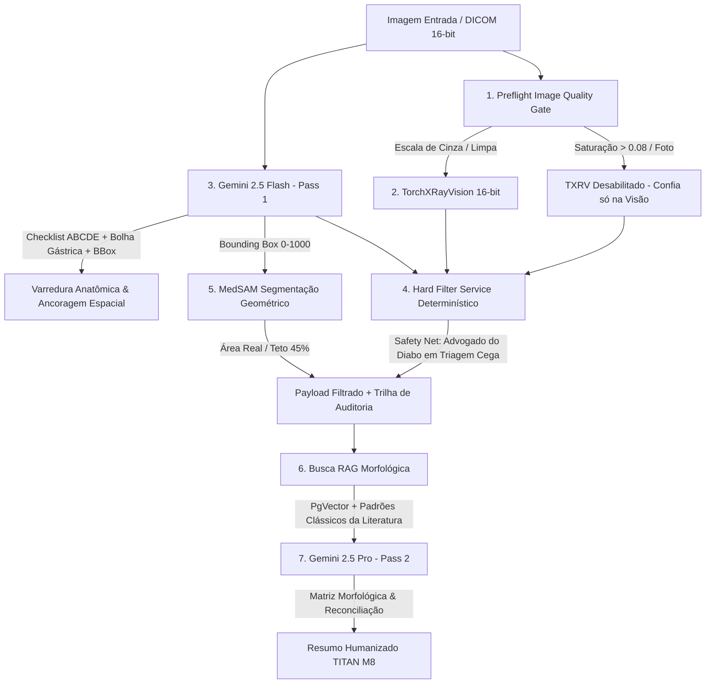

# Motor Híbrido de IA do TILA — TITAN v4.3 (Gemini-Duplo + Hard Filter Determinístico + MedSAM Geométrico + Blind Reading Mastery)

Este documento detalha a arquitetura de inteligência artificial de triagem e geração de pré-laudos radiológicos do ecossistema TILA, evoluída para a versão **TITAN v4.3**, projetada para máxima precisão clínica em triagem cega (sem indicação clínica), eliminação de erros de lateralização espacial (ancoragem na bolha gástrica) e dedução por matriz morfológica.

---

## 1. Visão Geral da Arquitetura em 7 Camadas (TITAN v4.3)

O serviço de IA do TILA (`tila-ai-service`) opera sob o paradigma **"Gemini no Início e no Fim" (LLM-as-Judge & Self-Consistency)**, integrando controles determinísticos de qualidade, varredura sistemática ABCDE e segmentação por MedSAM em 16-bit:

---

## 2. Detalhes Técnicos das Camadas e Barreiras de Proteção

### 2.1. Preflight Image Quality Gate (`ImageQualityService`)
Antes de executar qualquer modelo quantitativo, o sistema inspeciona o histograma de cores da imagem de entrada:
- **O Problema do Domain Shift:** Imagens submetidas por fotografias de filmes impressos ou monitores apresentam tonalidade azulada/amarelada e baixo alcance dinâmico. O TorchXRayVision foi treinado exclusivamente em matrizes DICOM em escala de cinza puro, gerando probabilidades erráticas e alucinações quando exposto a fotos.
- **A Solução Determinística:** Calcula-se a saturação média dos canais RGB (`saturacao_media`). Se a saturação for superior a `0.08`, o sistema identifica automaticamente a entrada como fotografia (*out-of-distribution*), desabilita a execução do TorchXRayVision (`adequada_para_txrv = False`) e instrui o pipeline a confiar exclusivamente na leitura visual visual do Gemini Pass 1.

### 2.2. Triagem Visual 16-bit e Sanity Check (`TorchXRayVision`)
O módulo `triagem_service.py` converte diretamente arquivos DICOM de 16-bit para a escala $[-1024, 1024]$ HU, preservando toda a faixa dinâmica sem perdas de compressão para 8-bit.
- O modelo avalia 18 patologias pulmonares.
- **Sanity Check:** Verifica desvio padrão e média dos pixels para detectar imagens mal calibradas antes da inferência.

### 2.3. Hard Filter Determinístico (`HardFilterService`)
Nas versões anteriores, a regra *"confie no visual, não na triagem"* era apenas uma sugestão de prompt no Pass 2, o que frequentemente falhava devido à natureza probabilística dos LLMs (ex: assumindo falsamente *Massa Pulmonar 56%* no caso COVID).
- No TITAN v4.1, a reconciliação é **física e determinística em código Python**.
- O `HardFilterService` cruza cada achado do TorchXRayVision com a descrição e os achados visuais gerados no Passo 1 pelo Gemini Flash.
- Achados quantitativos não corroborados pelo texto visual são **fisicamente removidos** do contexto enviado ao Gemini Pro e registrados no array de auditoria `achados_removidos`.

### 2.4. Segmentação Geométrica Real (`MedSAM` via `SegmentationService`)
O modelo MedSAM (`facebook/sam-vit-base`) é instanciado para gerar máscaras anatômicas precisas a partir das bounding boxes devolvidas pelo Passo 1.
- **Matemática Geométrica:** A porcentagem da lesão no hemitórax é calculada estritamente com base na área total real em pixels da imagem (`w * h`), eliminando heurísticas de *thumbnails*:
  $$\text{Porcentagem} = \left( \frac{\text{Área da BBox (px)}}{\text{Área Total da Imagem (px)}} \right) \times 100$$
- **Teto de Plausibilidade:** Implementado o limiar `PLAUSIBILITY_CEILING = 45.0%`. Lesões focais que excedam 45% do tórax recebem a marcação `medida_plausivel = False` e um alerta explicativo no relatório, evitando delimitações imprecisas.

### 2.5. Padrão LLM-as-Judge (Gemini Pass 1 vs Pass 2)
- **Pass 1 (Gemini 2.5 Flash):** Extrator visual rápido e neutro. Possui checklist explícito para detecção obrigatória de **cavitação** e **nível hidroaéreo** (`cavitacao_presente`, `nivel_hidroaereo_presente`), crucial para triagem de Tuberculose e abscessos.
- **Pass 2 (Gemini 2.5 Pro):** Atua como juiz clínico soberano. Recebe o dossiê pré-filtrado (sem ruído espúrio do TXRV) e redige o laudo final segregando claramente *Achados Principais*, *Achados Secundários* e *Impressão Diagnóstica*.

### 2.6. Blind Reading Mastery & Raciocínio Morfológico (TITAN v4.3)
Para garantir acurácia excepcional em **Triagem Cega** (exames sem indicação clínica ou histórico), o TITAN v4.3 implementa quatro salvaguardas adicionais (ver [[ADR-016-titan-v4-3-blind-reading-mastery]]):
- **Varredura Anatômica ABCDE:** O Pass 1 é obrigado a preencher o `ChecklistABCDE` (Vias Aéreas, Ossos/Parede, Coração, Diafragma, Campos Pulmonares) antes de qualquer conclusão, eliminando o viés de normalidade do VLM.
- **Ancoragem Espacial:** O modelo localiza obrigatoriamente a **Bolha Gástrica** para ancorar o lado **ESQUERDO** do paciente, eliminando erros de lateralização.
- **Safety Net — Advogado do Diabo:** Em triagem cega, probabilidades elevadas ($\ge 50\%$) do TXRV geram um mandato impositivo que proíbe o silêncio do Pass 2, obrigando-o a examinar meticulosamente a película ou justificar morfologicamente o descarte do alerta.
- **Matriz Morfológica:** O Pass 2 abandona chutes probabilísticos e estrutura o diagnóstico diferencial por eixos morfológicos (Infeccioso, Neoplásico ou Inflamatório/Vasculite/Alveolar), com injeção automática de Padrões Radiológicos Clássicos da literatura via RAG.

---

## 3. Transparência na API, Auditoria e Resumo para Leigos

No retorno do endpoint `POST /api/v1/laudos/gerar`, o contrato `PreLaudoResponse` entrega observabilidade completa:

1. **`qualidade_imagem`**: Informa se a imagem foi aceita pelo Preflight Gate (`adequada_para_txrv`), a saturação média e a justificativa técnica.
2. **`hard_filter_audit`**: Lista exata de todas as patologias quantitativas que foram removidas por falta de corroboração visual.
3. **`segmentacao`**: Retorna bounding boxes, área em pixels, área total da imagem e flag de plausibilidade geométrica.
4. **`resumo_para_leigo`**: Tradução humanizada e empática do laudo técnico (TITAN M8), explicando achados e condutas recomendadas de forma compreensível ao paciente sem gerar pânico.

---

## 4. Aviso Legal e Conformidade CFM/LGPD

Todo documento gerado carrega obrigatoriamente a advertência legal estabelecida pelo CRM/CFM:
> *"AVISO LEGAL (CFM / LGPD): Este documento constitui uma sugestão preliminar gerada por Inteligência Artificial (TITAN v4.3 — Gemini 2.5 Pro/Flash + TorchXRayVision + MedSAM) e NÃO possui validade médica legal. A revisão, validação e assinatura por um médico radiologista registrado no Conselho Regional de Medicina (CRM) são estritamente obrigatórias antes de qualquer liberação ao paciente ou conduta clínica."*
